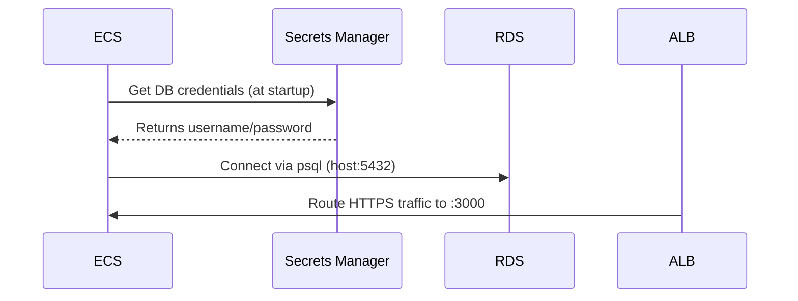
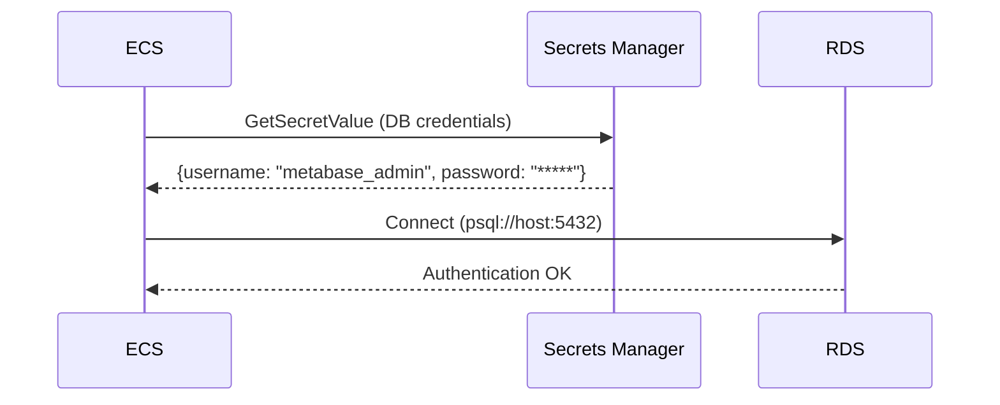
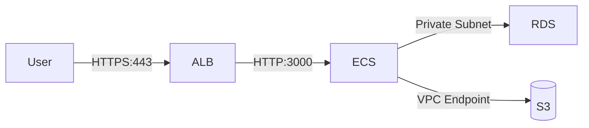

# This is a comprehensive README file dedicated to the Terraform Repo
## Structure of Terraform Repo via the tree command:

```mermaid
.
├── README.md
├── budget.json 
├── environments
│   ├── dev
│   │   ├── backend.tf
│   │   ├── main.tf
│   │   ├── outputs.tf
│   │   ├── providers.tf
│   │   ├── terraform.tfvars
│   │   ├── tfplan
│   │   └── variables.tf
│   └── prod
│       ├── backend.tf
│       ├── main.tf
│       ├── providers.tf
│       ├── terraform.tfvars
│       └── variables.tf
└── modules
    ├── alb
    │   ├── main.tf
    │   ├── outputs.tf
    │   └── variables.tf
    ├── ecs
    │   ├── main.tf
    │   ├── outputs.tf
    │   └── variables.tf
    ├── iam
    │   ├── main.tf
    │   ├── outputs.tf
    │   └── variables.tf
    ├── rds
    │   ├── README.md
    │   ├── main.tf
    │   ├── outputs.tf
    │   └── variables.tf
    └── vpc
        ├── main.tf
        ├── outputs.tf
        └── variables.tf

```

10 directories, 30 files

## Explaining the Terraform Structure

### I organized these Terraform files as re-usable files. By adding variables to ensure the customization later and avoid hardcoding, separating each module in a dedicated folder to ensure encapsulation of the logical components, and to avoid a monolithic structure. Outputs are used to expose key attribute to each module.

## The Architectures


### Architecture Diagram behind the inter-connection of these modules.



### Authentication Architecture Diagram:



### Architecture Diagram of the request flows:
