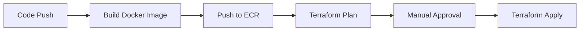
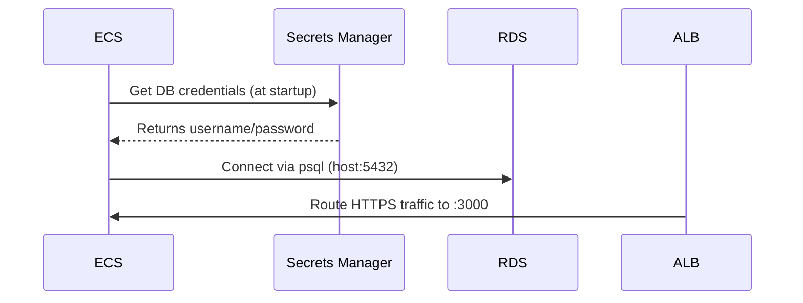
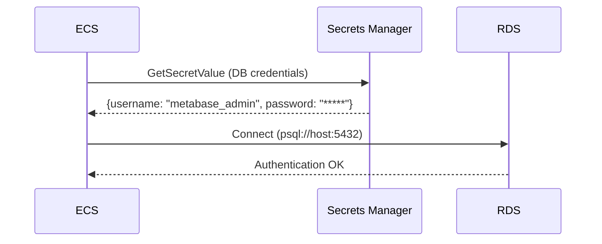
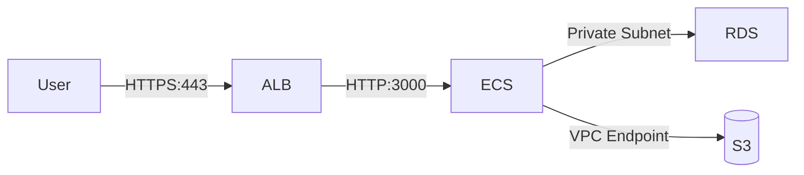
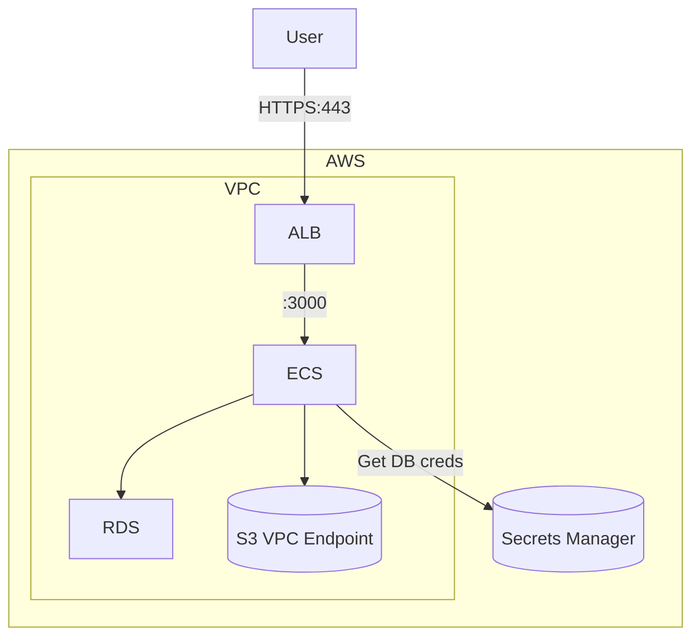

# This is a comprehensive README file dedicated to the Terraform Repo
## Structure of Terraform Repo via the tree command:

```bash
.
├── README.md
├── budget.json 
├── environments
│   ├── dev
│   │   ├── backend.tf
│   │   ├── main.tf
│   │   ├── outputs.tf
│   │   ├── providers.tf
│   │   ├── terraform.tfvars
│   │   ├── tfplan
│   │   └── variables.tf
│   └── prod
│       ├── backend.tf
│       ├── main.tf
│       ├── providers.tf
│       ├── terraform.tfvars
│       └── variables.tf
└── modules
    ├── alb
    │   ├── main.tf
    │   ├── outputs.tf
    │   └── variables.tf
    ├── ecs
    │   ├── main.tf
    │   ├── outputs.tf
    │   └── variables.tf
    ├── iam
    │   ├── main.tf
    │   ├── outputs.tf
    │   └── variables.tf
    ├── rds
    │   ├── README.md
    │   ├── main.tf
    │   ├── outputs.tf
    │   └── variables.tf
    └── vpc
        ├── main.tf
        ├── outputs.tf
        └── variables.tf

```

10 directories, 30 files

## Explaining the Terraform Structure

### I organized these Terraform files as re-usable files. By adding variables to ensure the customization later and avoid hardcoding, separating each module in a dedicated folder to ensure encapsulation of the logical components, and to avoid a monolithic structure. Outputs are used to expose key attribute to each module.

## Cost Saving Tips
- Use `single_nat_gateway = true` in dev
- Set `desired_count = 0` when not testing
- Enable ECS Spot instances
- NAT Gateway costs $0.045/hr (≈$32/month if running 24/7)
- ALB costs $0.025/hr (≈$18/month)
- **Always run `terraform destroy` after testing**

## Break-Glass Procedure
To nuke all resources immediately:
```bash
terraform destroy -auto-approve
```

## First-Time Setup
1. Create S3 bucket for Terraform state:
   ```bash
   aws s3api create-bucket --bucket your-tf-state-$(aws sts get-caller-identity --query Account --output text)

## The Architectures

### GitHub Actions simple CI/CD



## When CI/CD Runs
1. **On PR to Main**:
   - `terraform plan` (dry-run)
   - Docker image build test
2. **Merge to Main**:
   - Auto-deploy to dev
   - Requires manual approval for prod
3. **Scheduled (2AM UTC)**:
   - Destroy dev resources
   - Recreate fresh environment


## Security Best Practices
- [ ] Enable VPC Flow Logs
- [ ] Restrict ALB SG to known IPs
- [ ] Enable RDS encryption
- [ ] Rotate Secrets Manager values monthly

### Architecture Diagram behind the inter-connection of these modules.



### Authentication Architecture Diagram:



### Architecture Diagram of the request flows:





### IAM Roles Breakdown
| Role | Purpose | Critical Permissions |
|------|---------|----------------------|
| `ecsTaskExecutionRole` | Pull images + read secrets | `ecr:GetAuthorizationToken`, `secretsmanager:GetSecretValue` | 
| `ecsTaskRole` | Metabase app permissions | `rds-db:connect`, `s3:PutObject` |
| `ciCdRole` | GitHub Actions deploy | `ecs:UpdateService`, `ecr:BatchGetImage` |