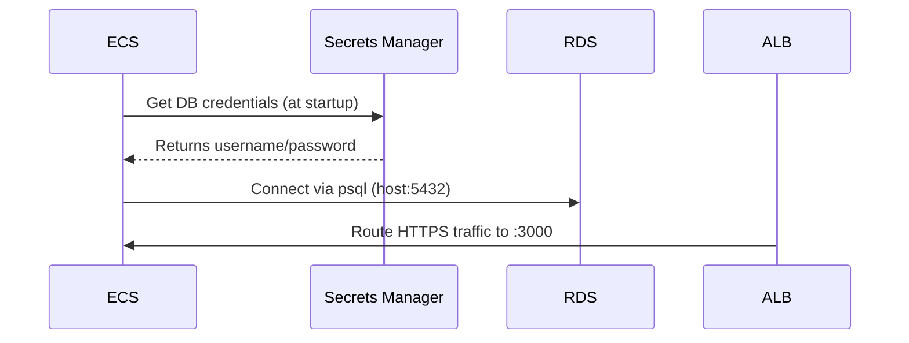
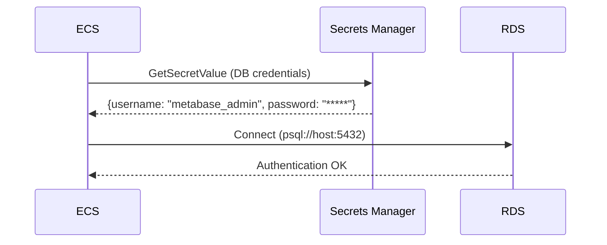
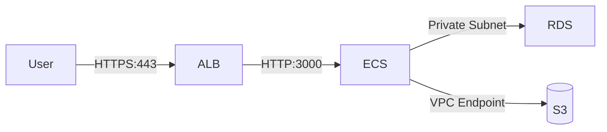

```mermaid
sequenceDiagram
    participant ECS
    participant SM as Secrets Manager
    participant RDS
    participant ALB

    ECS->>SM: Get DB credentials (at startup)
    SM-->>ECS: Returns username/password
    ECS->>RDS: Connect via psql (host:5432)
    ALB->>ECS: Route HTTPS traffic to :3000
```

```mermaid
sequenceDiagram
    participant ECS
    participant SM as Secrets Manager
    participant RDS
    ECS->>SM: GetSecretValue (DB credentials)
    SM-->>ECS: {username: "metabase_admin", password: "*****"}
    ECS->>RDS: Connect (psql://host:5432)
    RDS-->>ECS: Authentication OK
```

```mermaid
flowchart LR
    User-->|HTTPS:443|ALB
    ALB-->|HTTP:3000|ECS
    ECS-->|Private Subnet|RDS
    ECS-->|VPC Endpoint|S3[(S3)]
```